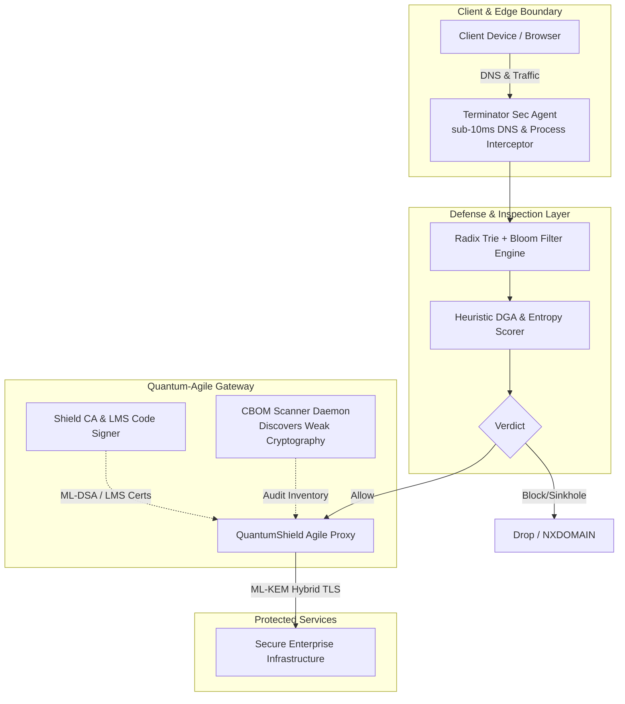

<div align="center">

# 🛡️ Security in Quantum Era ⚛️

### *Next-Generation Cryptographic Migration & Zero-Trust Defensive Systems*

[](LICENSE)
[](CONTRIBUTING.md)
[](https://go.dev/)
[](https://www.typescriptlang.org/)
[](https://python.org)
[](https://velithsoftware.vercel.app)

<br/>

**Security in Quantum Era** is an open-source, monorepo ecosystem designed to tackle the next frontier of cybersecurity: transitioning from vulnerable classical public-key cryptography to **Post-Quantum Cryptography (PQC)**, and delivering sub-10ms defensive endpoint protection against modern threats.

[Explore Projects](#-project-pillars) • [Live Showcase](https://velithsoftware.vercel.app) • [Architecture](#-architecture--ecosystem) • [Contributing](CONTRIBUTING.md) • [Getting Started](#-quick-start)

---

</div>

## 🌌 Why This Matters: The Quantum Threat Horizon

Quantum computers running Shor's algorithm will soon break traditional asymmetric encryption algorithms (RSA, ECC, Diffie-Hellman). Adversaries are executing **"Harvest Now, Decrypt Later" (HNDL)** attacks—storing encrypted communication today to decrypt once cryptographically relevant quantum computers (CRQCs) arrive.

This repository provides software and cryptographic tooling for:
1. **PQC Cryptographic Agility & Migration**: Transitioning protocols to NIST-standardized Post-Quantum algorithms (ML-KEM/Kyber, ML-DSA/Dilithium, LMS).
2. **Defensive Zero-Trust Interception**: Low-latency, multi-tier threat inspection on endpoint boundaries before queries leave host networks.
3. **Interactive Visual Architecture**: Demonstrating real-time cryptographic transitions, risk surfaces, and defensive boundaries.

---

## 🏛️ Project Pillars

| Sub-Project | Focus Area | Technology Stack | Status |
|:---|:---|:---|:---:|
| [**Quantum PQC (QuantumShield)**](./projects/quantum_pqc) | NIST Post-Quantum Cryptography migration, hybrid TLS proxy, CBOM scanner, LMS stateful code signer, and Certificate Authority | Go, Python, Next.js, Docker, Swift | Active |
| [**Terminator Sec**](./projects/terminator_sec) | Sub-10ms zero-trust defensive agent, DNS interception proxy, Radix Trie & Bloom filter threat engine, heuristic DGA scorer | Go 1.25, React, Tailwind, Swift | Active |
| [**Portfolio & Showcase**](./portfolio) | Interactive Web showcase demonstrating live threat models, quantum risk topology, and system architecture | HTML5, Modern CSS, Three.js, Vercel | [Live 🌐](https://velithsoftware.vercel.app) |

---

## 🧩 Architecture & Ecosystem



---

## 📂 Repository Structure

```
security_in_quantumera/
├── .github/                     # Issue templates & community health files
├── portfolio/                   # Interactive Showcase & Visualizer (Live: velithsoftware.vercel.app)
│   ├── index.html
│   ├── styles.css
│   ├── scene.js                 # Three.js infrastructure visualizer
│   └── site.js
│
├── projects/
│   ├── quantum_pqc/             # Post-Quantum Cryptographic Migration Platform
│   │   ├── apps/
│   │   │   ├── api/             # Go REST API & CA engine
│   │   │   ├── proxy/           # Crypto-agile hybrid reverse proxy
│   │   │   └── scan/            # Python CBOM scanner daemon & vulnerability DB
│   │   ├── shared/crypto/       # ML-KEM, ML-DSA, LMS wrappers & unit tests
│   │   ├── proxy-swift/         # Swift Metal compute & proxy acceleration
│   │   └── web/                 # Next.js Trust Center dashboard
│   │
│   └── terminator_sec/          # Zero-Trust Endpoint Protection Agent
│       ├── apps/dashboard/      # React + Vite fleet & live threat feed UI
│       ├── cmd/                 # terminator-agent, terminator-cli, terminator-server
│       ├── pkg/engine/          # Radix Trie, Bloom filter, and heuristic analyzers
│       ├── pkg/interceptor/     # Real-time DNS & network hook proxies
│       └── agent-swift/         # Native macOS agent integration
│
├── CONTRIBUTING.md              # Contributor guide, workflow, and testing
├── LICENSE                      # MIT Open Source License
└── README.md
```

---

## ⚡ Quick Start

### 1. Clone the Monorepo
```bash
git clone https://github.com/abhinav37-git/security_in_quantumera.git
cd security_in_quantumera
```

### 2. Run Quantum PQC Migration Platform
```bash
cd projects/quantum_pqc

# Run crypto tests (ML-KEM / ML-DSA / LMS)
go test -v ./shared/crypto/...

# Start the full stack with Docker Compose
docker-compose up -d --build
```
> Access the Next.js Trust Center dashboard at `http://localhost:3000`.

### 3. Run Terminator Sec Defensive Agent
```bash
cd projects/terminator_sec

# Run engine tests
go test -v ./pkg/engine/...

# Build the agent and CLI binaries
make build

# Start the live threat dashboard
cd apps/dashboard
npm install
npm run dev
```
> Access the threat dashboard at `http://localhost:5173`.

### 4. Run the Portfolio Showcase Locally
```bash
cd portfolio
python3 -m http.server 8080
# Visit http://localhost:8080 or see it live at https://velithsoftware.vercel.app
```

---

## 🤝 Contributing to Open Source

We actively encourage community participation! Contributions can take many forms:
- 🔬 **Algorithm Implementations**: Adding support for additional round 4 NIST PQC candidates (e.g., Falcon, SPHINCS+).
- ⚡ **Performance Optimization**: SIMD / Assembly / Metal acceleration for post-quantum lattice polynomial multiplications.
- 🛡️ **Threat Heuristics**: Enhancing DGA classifiers, Radix search trees, and Bloom filter hash distribution.
- 📖 **Documentation & Guides**: Writing migration tutorials, CBOM compliance guides, or benchmarking reports.

Please review our [**Contributing Guide**](CONTRIBUTING.md) for details on code style, commit standards, and the pull request process.

---

## 🛡️ Security & Responsible Disclosure

If you discover a security vulnerability or algorithmic weakness in this repository, please review our [Security Guidelines](CONTRIBUTING.md#-security-vulnerability-reporting) to submit a responsible disclosure. Please avoid filing public issues for sensitive security defects.

---

## 📄 License

This project is licensed under the [MIT License](LICENSE) — free for individual, educational, research, and commercial use.
