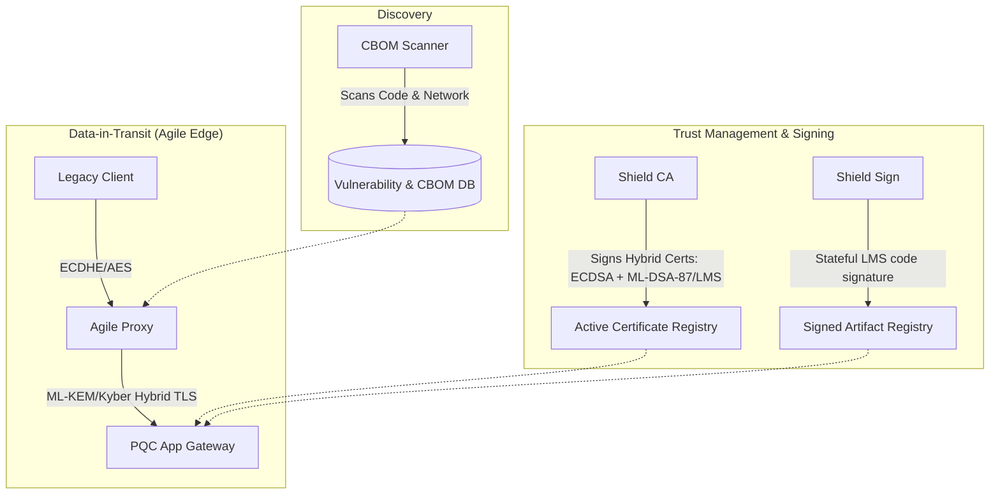

# 🛡️ QuantumShield: End-to-End Post-Quantum Cryptographic Migration Platform

[](https://opensource.org/licenses/MIT)
[](https://golang.org)
[](https://nextjs.org)
[](https://www.postgresql.org)

QuantumShield is a comprehensive, production-grade post-quantum cryptographic (PQC) migration platform. It bridges legacy infrastructure with next-generation NIST and CNSA 2.0 standards, addressing the "Harvest Now, Decrypt Later" threat without requiring complete application rewrites.

---

## 🏗️ System Architecture

QuantumShield coordinates four critical security pillars to protect data-in-transit, trust management, and software update lifecycles.



---

## 🌟 Pillars of the Platform

### 1. 🔍 Shield Scan (CBOM Discovery)
An intelligent scanning daemon that inventories software components (SBOM) and maps all cryptographic elements (ciphers, key sizes, hashes) into a **Cryptography Bill of Materials (CBOM)** to locate vulnerable legacy algorithms (e.g. RSA, SHA-1).

### 2. ⚡ Shield Proxy (Crypto-Agile Translation Gateway)
A high-throughput reverse proxy that translates standard classical SSL/TLS requests into post-quantum hybrid handshakes (negotiating ML-KEM/Kyber algorithms) to protect legacy backends.

### 3. 🔑 Shield CA (Hybrid Certificate Authority)
A trust center that generates standard, backwards-compatible X.509 certificates containing embedded post-quantum signature fields (ML-DSA-87 and Leighton-Micali Signatures) in custom ASN.1 extensions (`1.3.6.1.4.1.58888.1`).

### 4. ✍️ Shield Sign (Stateful Code Signer)
A stateful hash-based signing microservice following RFC 8554 guidelines. It tracks state counters in-memory and in-database to issue Leighton-Micali Signatures (LMS) for secure software and firmware releases.

---

## 📂 Project Structure

```text
quantum_pqc/
├── apps/
│   ├── api/             # Go REST API Gateway & CA Engine
│   ├── proxy/           # Go Crypto-Agile Reverse Proxy
│   └── scan/            # Python CBOM Discovery Daemon
├── shared/
│   └── crypto/          # Shared PQC primitives wrapper (LMS, ML-DSA)
├── web/                 # Next.js Trust Center dashboard
└── docker-compose.yml   # Multi-service stack coordinator
```

---

## 🚀 Quick Start

### Prerequisites
*   [Docker](https://www.docker.com/) and Docker Compose installed.
*   [Go 1.24+](https://golang.org/) (optional, for local test runners).

### Launching the Stack
Run the following command at the repository root to compile all binaries, launch PostgreSQL, Redis, the translation proxies, and start the dashboard:

```bash
docker compose up --build -d
```

Confirm all services are active:
```bash
docker ps
```

*   **API Gateway**: `http://localhost:8080`
*   **Translation Proxy**: `https://localhost:8443`
*   **Next.js Dashboard**: `http://localhost:3000`

---

## 🧪 E2E Verification & Interactive CLI Testing

We provide interactive runners to verify post-quantum signature validity and certificate structures against the live network.

### 1. Verification of Hybrid Certificates (ML-DSA-87 & LMS)
Execute the certificate verifier script to request certificates, extract the custom post-quantum signatures extension, and cryptographically validate the signatures:

```bash
go run scratch/verify_ca.go
```

### 2. Verification of Stateful Code-Signing (LMS)
Execute the code signer verifier script to issue a stateful signature, verify it against the public directory, test rejection against a tampered payload, and audit the PostgreSQL history ledger:

```bash
go run scratch/verify_sign.go
```

### 3. Manual CURL Verification Probes
*   **Retrieve CA Public Directories**:
    ```bash
    curl http://localhost:8080/api/ca/root-keys
    ```
*   **Request ML-DSA-87 Certification**:
    ```bash
    curl -X POST -H "Content-Type: application/json" \
      -d '{"common_name": "api.shield.internal", "signature_algorithm": "ML-DSA-87"}' \
      http://localhost:8080/api/ca/issue
    ```
*   **Sign Firmware Payload with LMS**:
    ```bash
    curl -X POST -H "Content-Type: application/json" \
      -d '{"artifact_name": "fw.bin", "payload": "firmware_hex_payload_data"}' \
      http://localhost:8080/api/sign
    ```

---

## 📜 License
Distributed under the MIT License. See `LICENSE` for more information.
